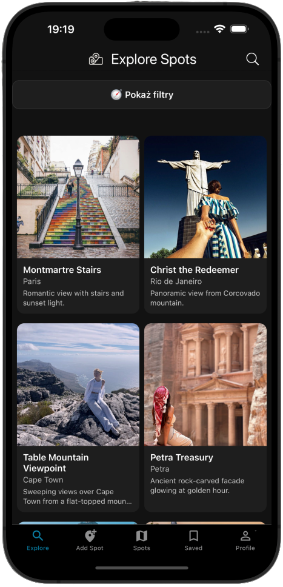
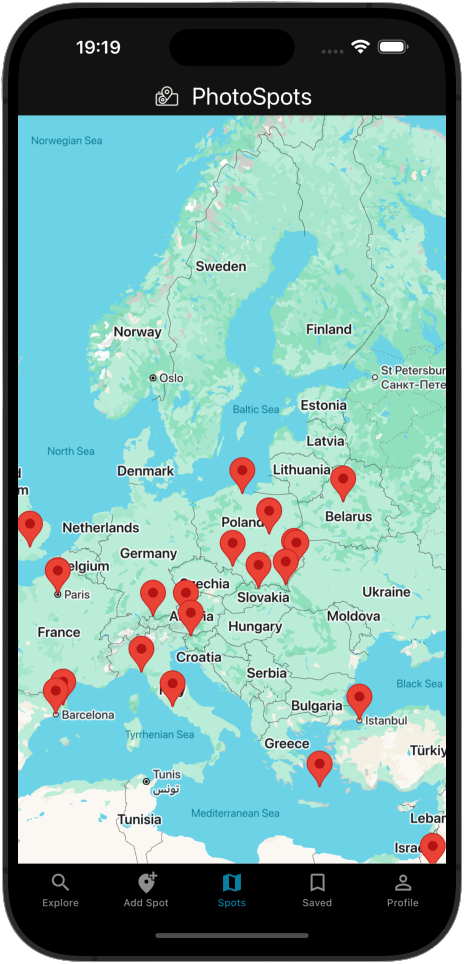
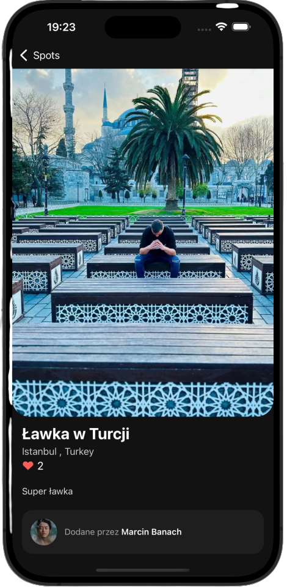
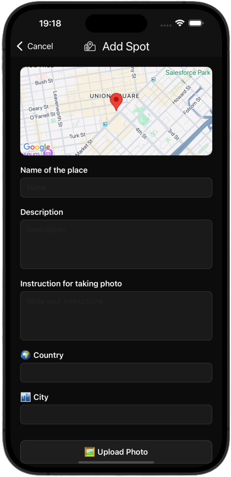
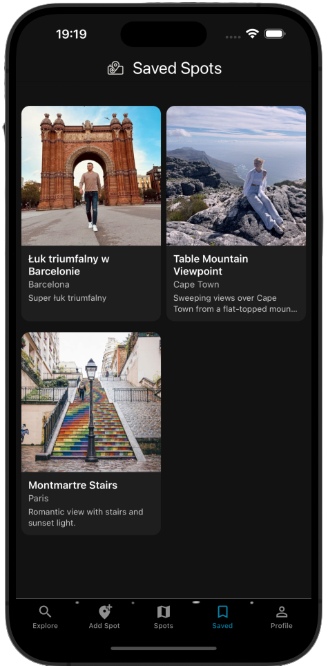

# 📸 SpotShot — Discover & Share the Best Photo Spots Around the World

**SpotShot** is a mobile application for travelers, photographers, and content creators to discover, share, and save the best locations for taking photos — anywhere in the world. Whether you’re into breathtaking landscapes, vibrant city corners, hidden cafes, or unique street art, SpotShot helps you find exactly where to go and how to capture it.

---

## ✨ Features

### 🗺 Explore Photo Spots

Browse an interactive map filled with community-added photo locations. Zoom into any area and instantly see pins with images and descriptions.

  
  

### 📄 Spot Details

Open a location to view:

- A high-quality preview image
- Description of the place
- Photography tips for the best shot
- Exact coordinates with Google Maps integration

  

### ➕ Add Your Own Spots

Contribute to the community by adding your own photo spots:

- Upload a photo from your device
- Add the location (city, country, GPS coordinates)
- Write a description and photography tips
- Instantly share it with the world

  

### ❤️ Save to Favourites

Keep track of your favorite locations by adding them to your **Saved Spots** list for quick access later.

  

### 📊 Likes & Popular Spots

See how many people have saved a spot — discover trending locations loved by the community.

### 🚗 Google Maps Navigation

Navigate to any spot directly from the app with one tap.

---

## 🎯 Project Vision

SpotShot aims to become a global community of travelers and creators who share their favorite photo locations, inspiring others to explore the world in a more intentional and creative way.

Over time, the app will expand with:

- Community challenges
- User profiles with photography portfolios
- Advanced search and filtering
- Offline spot saving for travelers without internet access

---
